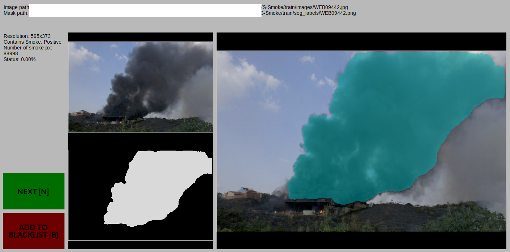
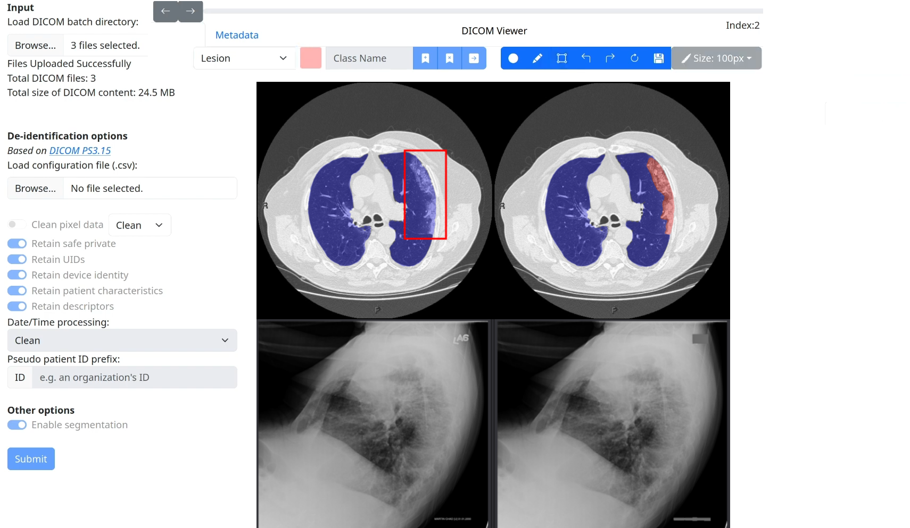
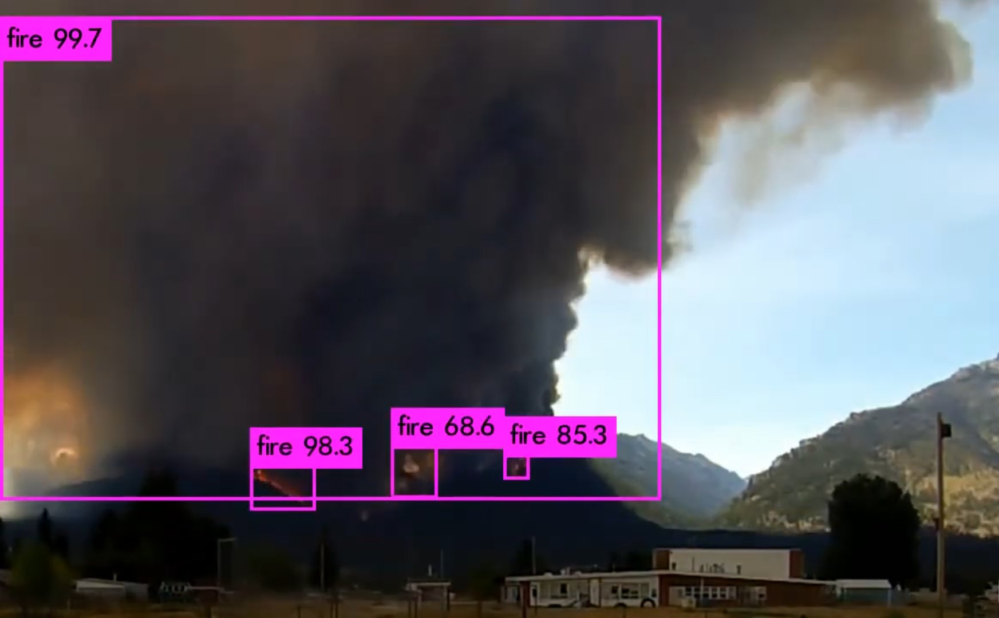
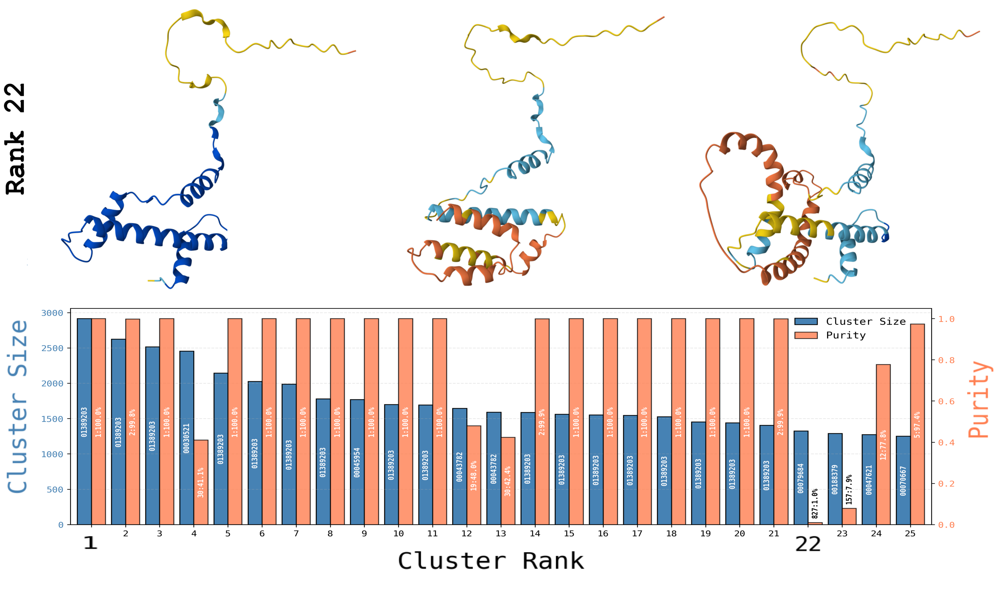
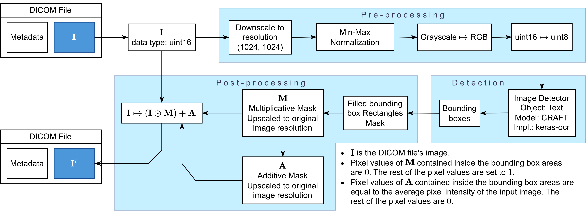
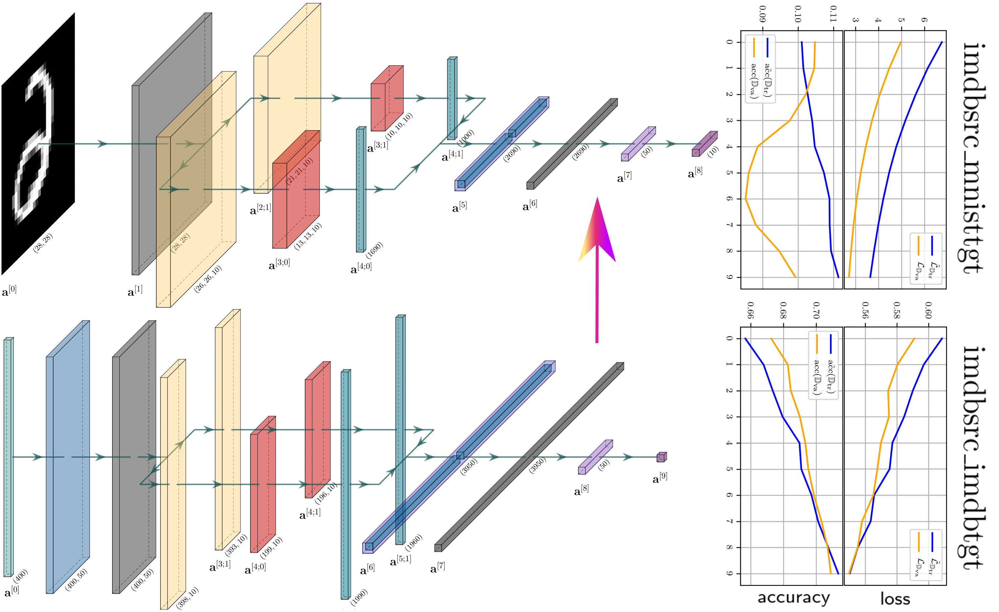
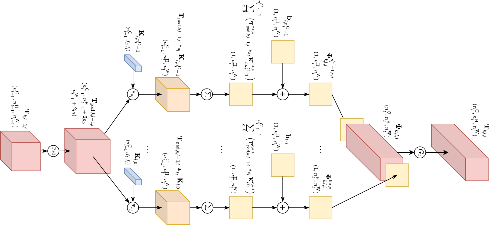
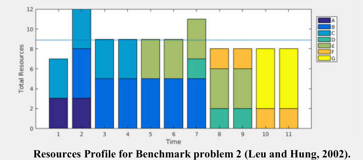
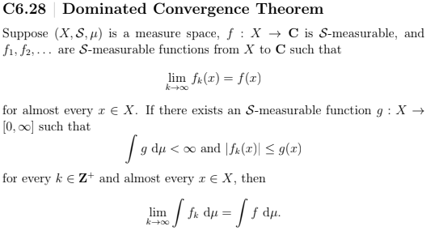

   
  <strong>SeqWork</strong>
   
  Image &amp; Sequence Processing R&D

---

> `> SOLUTIONS`

  <table>
    <tr>
      <td align="center" width="33%">
        
         
        <strong>SmokeSegmenter</strong> — Semi-automated smoke segmentation using SAM
      </td>
      <td align="center" width="33%">
        
         
        <strong>MedDiSC</strong> — DICOM de‑identification, Segmentation &amp; Curation Tool [1]
      </td>
      <td align="center" width="33%">
        
         
        <strong>Startup Initiative</strong> — Wildfire detection system presented in two competitions and a fire department
      </td>
    </tr>
  </table>

> `> RESEARCH`

  <table>
    <tr>
      <td align="center" width="33%">
        
         
        <strong>Computational Genomics</strong> — Baseline analysis [2] of the twelve thousand natural proteomes; part of the StratoCluster research initiative; presented in HBioinfo17 (RECOMB 2026)
      </td>
      <td align="center" width="33%">
        
         
        <strong>DICOM De-identifier Utility</strong> — De-identified over two million DICOM images for INCISIVE (HORIZON 2020) [3]
      </td>
      <td align="center" width="33%">
        
         
        <strong>M.Eng. Thesis</strong> — Transfer learning of CNNs between image and text modalities
      </td>
    </tr>
  </table>

  <table>
    <tr>
      <td align="center" width="33%">
        
         
        <strong>netfieldv1</strong> — Derived, vectorized, and implemented backpropagation from scratch for any LeNet-like CNN architecture (NumPy/CuPy)
      </td>
      <td align="center" width="33%">
        
         
        <strong>Sonar Inspired Optimization (SIO)</strong> — A nature-inspired metaheuristic for optimal resource leveling in project management [4]
      </td>
      <td align="center" width="33%">
        
         
        <strong>Rigorous Mathematics</strong> — Proof of the Dominated Convergence Theorem for the Lebesgue integral [5], developed in alignment with Axler's: Measure, Integration & Real Analysis (2022).
      </td>
    </tr>
  </table>

  — built by —

<h1 align="center">👋 Greetings, I am Apostolos M. Dimoulakis</h1>

## 👨‍💻 About Me

I am a ML/AI engineer and researcher with a background in deep learning, computational genomics, software engineering, and rigorous mathematics.

I build things that work — in bioinformatics, in engineering, in research, and in the wild. I build clean, scalable, and documented systems, and I'm just as comfortable deriving math as I am shipping code. From backpropagation by hand to pipelines that process 80 million protein sequences, I bridge theory and practice.

Open to freelancing, consulting, and full‑time roles. I deliver value, not just code. I embrace completeness, and I refuse to vibe code.

### 📫 Contact

  
  
  

## 🔬 Research Interests

- Machine Learning & Deep Learning
- Computational Genomics & Proteomics
- Interpretability & Explainable AI
- Optimization & Linear Algebra
- Scalable Graph Clustering & High Performance Computing

## 🛠️ Technical Skills

**Expertise:** Python, NumPy, Git, Bash Shell

**Familiarity:** C, PyTorch, MySQL, JavaScript, PHP, Markdown, HTML, Java, TeX, MATLAB, Segment Anything Model, YOLO, darknet, Pandas, Matplotlib, Docker

**Bioinformatics Tools:** DIAMOND, MCL, HipMCL, ChimeraX, BLAST

**Theoretical:** Machine Learning, Deep Learning, Linear Algebra, Statistics, Convex Optimization, [Mathematical Analysis](https://drive.google.com/file/d/1SJsKJWXQa-w-zUuzjFBiInODYKBM7dEu/view), Genomics, Finance, Operations Research

## 📂 Featured Projects

| Project | Description |
|---------|-------------|
| [`SmokeSegmenter`](https://github.com/fl0wxr/SmokeSegmenter) | Automated smoke segmentation using SAM |
| [`bioscflow`](https://github.com/fl0wxr/bioscflow) | Python pipeline for large‑scale protein sequence clustering using MCL and HipMCL |
| [`msc-thesis`](https://github.com/fl0wxr/msc-thesis) | LaTeX source for my MSc thesis on scalable protein clustering |
| [`netfieldv1`](https://github.com/fl0wxr/netfieldv1) | Derived, vectorized, and implemented backpropagation from scratch for any LeNet-like CNN architecture (NumPy/CuPy) |
| [`img-sim`](https://github.com/fl0wxr/img-sim) | SimCLR implementation for contrastive learning |
| [`machine_translator`](https://github.com/fl0wxr/machine_translator) | Greek–English machine translation with RNNs (PyTorch) |

## 🎓 Education

- **M.Sc. in Artificial Intelligence** — Aristotle University of Thessaloniki *(completed 2026)*
- **M.Eng. in Financial & Management Engineering** — University of the Aegean (2014–2019)

## 📚 Reference

[1] A. Dimoulakis, E. Politis, M. Nikolaidis, P. Bizopoulos, and K. Votis. "MedDiSC: Medical De-identification, Segmentation & Curation Tool". Manuscript. SSRN. 2024-05-01. Available at: https://ssrn.com/abstract=4813479

[2] A. Dimoulakis. "Computational Genomics — Analysis of a Scalable and Reproducible Clustering Workflow in Protein Sequence Similarity Networks". Master's Thesis. Aristotle University of Thessaloniki, Greece. 2026. Available at: https://drive.google.com/file/d/1AVaMdupbLhaNpim_sLAkbQsNUr2tf3QD/view?usp=sharing

[3] INCISIVE Project Consortium. "D6.7 Best Practices for DICOM De-identification". Project Deliverable. INCISIVE (HORIZON 2020). 2024-06-30. Available at: https://incisive-project.eu/wp-content/uploads/2024/06/INCISIVE_D6-7_Best-Practices_final.pdf

[4] A. Tzanetos, C. Kyriklidis, A. Papamichail, A. Dimoulakis, and G. Dounias. "A Nature Inspired Metaheuristic for Optimal Leveling of Resources in Project Management". Conference Paper. Association for Computing Machinery (ACM), New York, United States. SETN '18: Proceedings of the 10th Hellenic Conference on Artificial Intelligence, 2018-07-09. doi:10.1145/3200947.3201014. Available at: https://doi.org/10.1145/3200947.3201014

[5] A. Dimoulakis. "Complementary notes aligned with Axler's *Measure, Integration & Real Analysis* book, covering foundational topics in metric spaces, Lebesgue integration, and functional analysis". 2022-06. Available at: https://drive.google.com/drive/folders/1p6rbD9gTxQGJupflapUb5uy8YYFP4eRU?usp=sharing

---

> *"If it isn't documented, it doesn't exist."*
